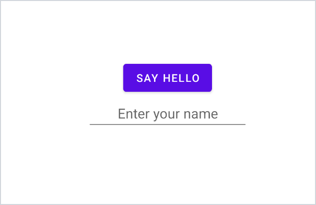
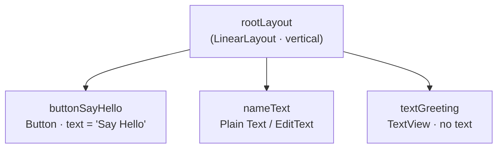
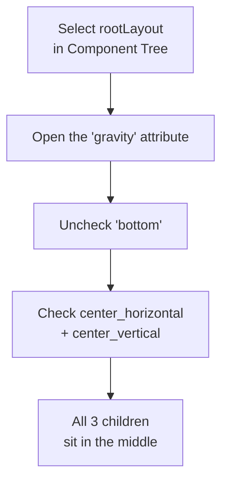

# Android Studio Intro - Justin Guida

A simple school assignment for an intro Android development course. The goal of
this module was to get familiar with **Android Studio** and the **Layout Editor**
by building a basic screen - no app logic, just the layout.

## What it is

A single layout (`activity_main.xml`) built with the Layout Editor. It contains
three UI elements:

| Element        | ID               | Notes                        |
|----------------|------------------|------------------------------|
| Button         | `buttonSayHello` | Text = "Say Hello"           |
| Plain Text (EditText) | `nameText`| Hint = "Enter your name"     |
| TextView       | `textGreeting`   | Intentionally has no text    |

## Screenshots

**Layout preview:**



**Component Tree (three objects + IDs):**


## Component Tree hierarchy

How the three objects nest inside the root container:



## How the button was centered

Centering is set on the **container** (`rootLayout`), not on the button itself:



Key idea:
- **`gravity`** on `rootLayout` → positions the children **inside** the container (used here).
- **`layout_gravity`** → would position an element inside **its** parent.
- The button was also shrunk from full width by setting its
  **`layout_width` = `wrap_content`** (instead of `match_parent`).

## Project setup

- **Language:** Java
- **Target SDK:** API 34
- **Build config:** Groovy DSL
- **Activity:** No Activity (per assignment instructions)

## Layout file

The layout lives at:

```
app/src/main/res/layout/activity_main.xml
```

## Notes

Personal study notes on the Layout Editor (gravity, text/strings, colors,
centering) are in the [`notes/`](notes/) folder.

## Requirements

The full assignment rubric this project satisfies is in
[`docs/REQUIREMENTS.md`](docs/REQUIREMENTS.md).

## Reflection

The written discussion of challenges, initial experience, and questions is in
[`docs/REFLECTION.md`](docs/REFLECTION.md). A ready-to-submit Word version is at
[`docs/Android_Studio_Assignment_Justin_Guida.docx`](docs/Android_Studio_Assignment_Justin_Guida.docx).
