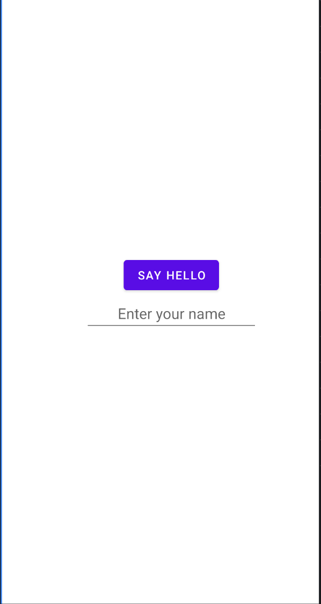
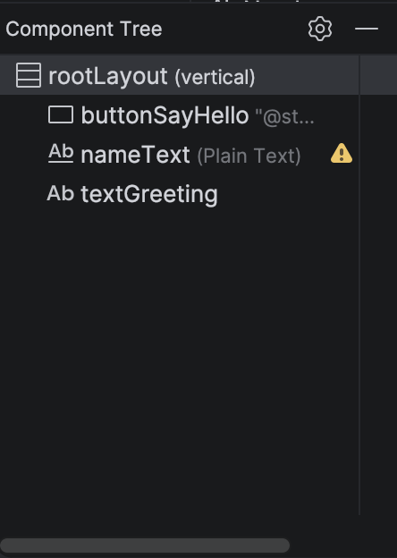

# Android Studio — Reflection and Challenges

**Justin Guida**

## Screenshots

**Layout Editor — activity_main.xml (Button, Plain Text, TextView):**

**Component Tree — the three objects and their IDs:**

## Discussion of Challenges (200+ words)

My initial experience with Android Studio was a mix of curiosity and
frustration, which I think is normal when learning a brand new tool. Setting the
project up was straightforward once I remembered to choose the **No Activity**
option so that I could select **Java** as the language, but the first-time build
did take several minutes while the environment downloaded and configured its
dependencies. Watching the Build tab at the bottom of the screen helped me
confirm it was actually working and not frozen.

The biggest challenge I ran into was **getting the button centered in the middle
of the screen**. At first nothing I did seemed to move it. I eventually learned
that centering is not done on the button itself — you have to select the root
**LinearLayout** in the Component Tree and change its **gravity** value. Once I
unchecked `bottom` and set `gravity` to `center` (or checked `center_horizontal`
and `center_vertical` together), all three elements finally moved to the middle.
Understanding the difference between `gravity` (which positions the children
inside a container) and `layout_gravity` (which positions an element inside its
parent) was the key insight that made this click.

My second challenge was that the **button stretched across the entire width of
the screen** instead of only being as wide as its text. I fixed this by changing
the button's `layout_width` from `match_parent` to **`wrap_content`**, which
tells the button to only take up as much space as its "Say Hello" label needs.
Along the way I also accidentally created a **duplicate ID** by naming two views
`rootLayout`, and I had to rename the Plain Text field back to `nameText` to
clear the error, since two views cannot share the same ID.

Overall, once I understood that I had to select the correct element in the
Component Tree before editing its attributes, the Layout Editor started to make
a lot more sense. My main remaining question is when it is better to build a
layout visually with the editor versus editing the XML directly, and how the
different layout containers (LinearLayout, ConstraintLayout, etc.) compare for
positioning elements. I feel much more prepared to access and use Android Studio
for the later work in this course.
