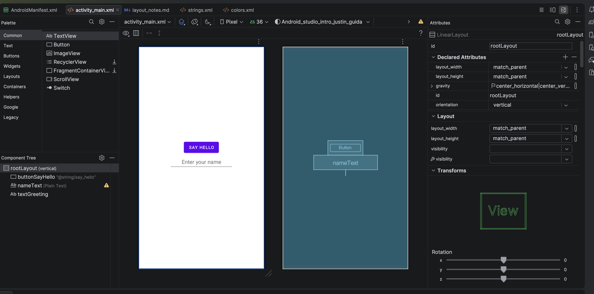
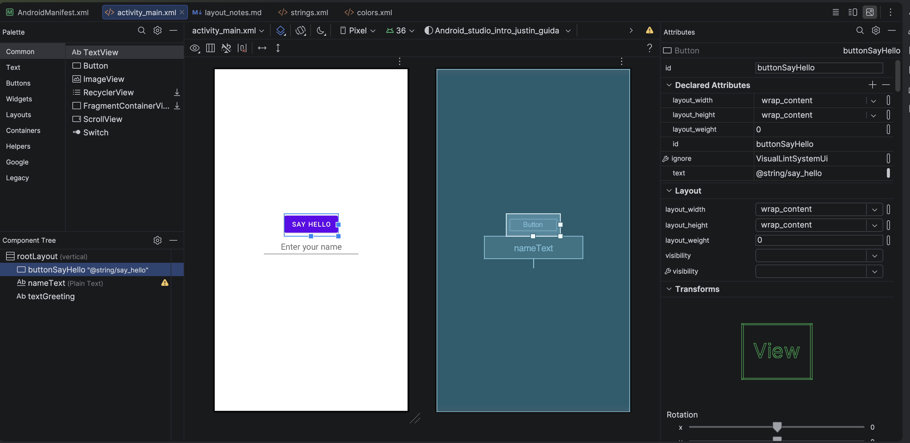
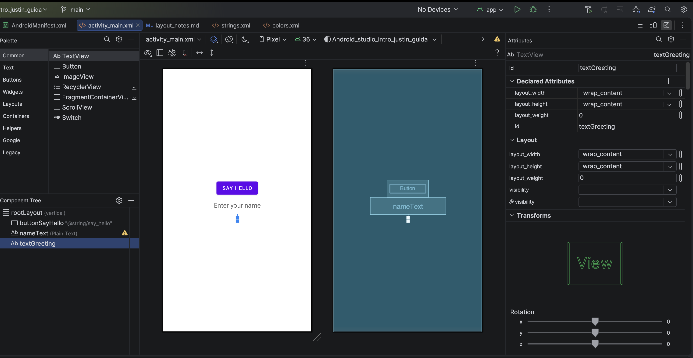

# Introduction to Android Studio: Layout Editor Assignment

**Justin Guida**

## Layout Editor: activity_main.xml

The layout contains three objects: a Button (buttonSayHello, text "Say Hello"),
a Plain Text / EditText (nameText), and a TextView (textGreeting) with no text.
All three are children of a vertical LinearLayout (rootLayout), centered on the
screen.

_Figure 1. Layout Editor for activity_main.xml. The Component Tree (lower left)
lists all three objects: buttonSayHello, nameText (Plain Text), and textGreeting.
The design and blueprint views show the "Say Hello" button, the plain-text field,
and the empty TextView._

## Element Identification (IDs and Attributes)

Each element was given a relevant ID and its text set according to the
instructions. The screenshots below show each object selected in the Component
Tree with its Attributes panel open, confirming the ID and text values.

_Figure 2. Button selected. id = buttonSayHello, text = @string/say_hello
("Say Hello"), layout_width = wrap_content._

_Figure 3. Plain Text field selected (EditText). id = nameText, with a hint of
"Enter your name."_

_Figure 4. TextView selected. id = textGreeting, with all text removed as
required._

## Discussion of Challenges

My initial experience with Android Studio was a mix of curiosity and frustration,
which I think is normal when learning a brand-new tool. Setting the project up was
straightforward once I followed the instructions on the page, I remembered to
choose the No Activity option so that I could select Java as the language, the
first-time build didn't take several minutes which was nice I believe that was due
to my Apple M4 which was quick.

The biggest challenge I encountered was centering the button on the screen. I
wanted the interface to look more balanced, but at first nothing I changed seemed
to move it. I eventually realized that, because I wanted to center all three
elements together, I needed to select the root LinearLayout in the Component Tree
and change its gravity value. After removing the bottom setting and using center,
or combining center_horizontal and center_vertical, the button, Plain Text field,
and TextView moved to the middle of the screen. Understanding the difference
between gravity, which positions child views inside a container, and
layout_gravity, which positions an individual view within its parent, was the key
concept that made this process clearer.

My second challenge was that the button stretched across the entire width of the
screen instead of fitting around its text. I corrected this by changing the
button's layout_width from match_parent to wrap_content, which made it only as
wide as the "Say Hello" label required. I also accidentally created a duplicate ID
by assigning rootLayout to both the root layout and the Plain Text field. I fixed
the error by changing the Plain Text field's ID back to nameText, since every view
in the same layout must have a unique ID.

Overall, once I understood that I had to select the correct element in the
Component Tree before editing its attributes, the Layout Editor started to make a
lot more sense. My main remaining question is when it is better to build a layout
visually with the editor versus editing the XML directly, and how the different
layout containers (LinearLayout, ConstraintLayout, etc.) compare for positioning
elements. I feel much more prepared to access and use Android Studio for the later
work in this course.
